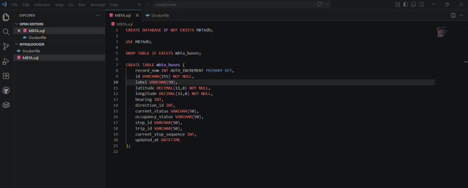
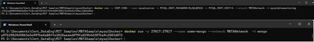
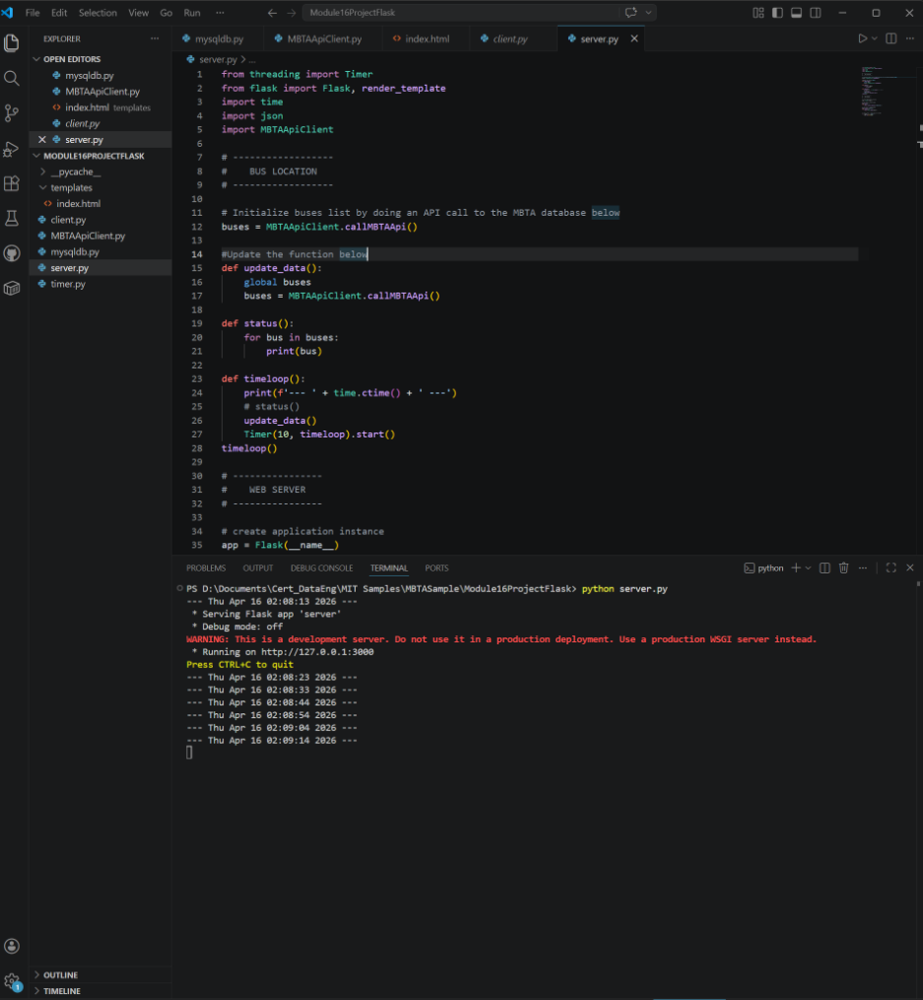
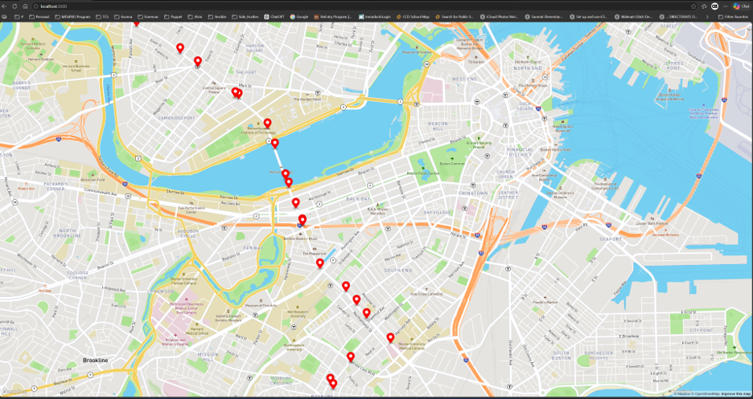
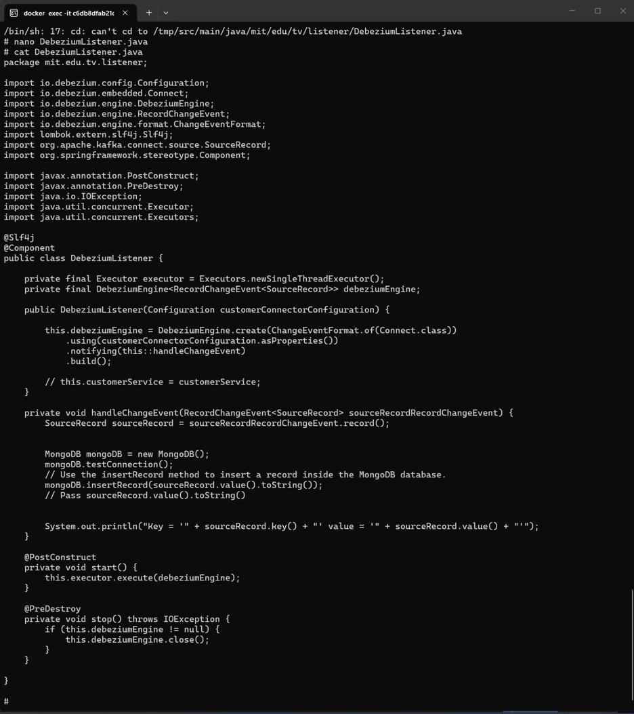
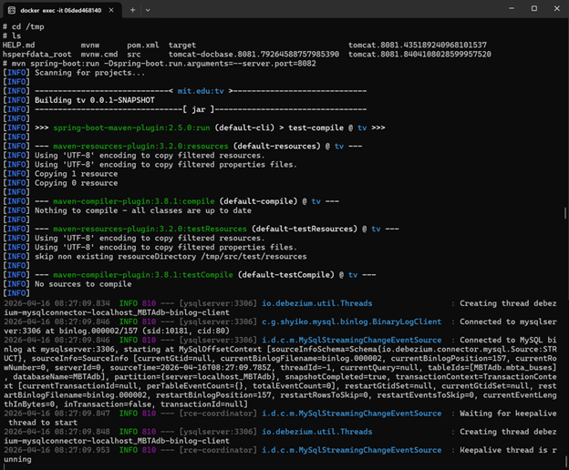
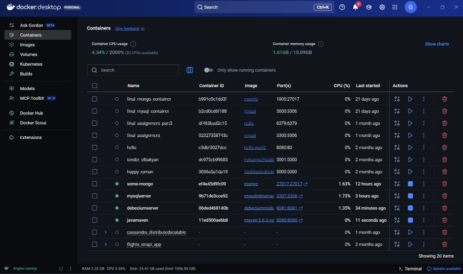
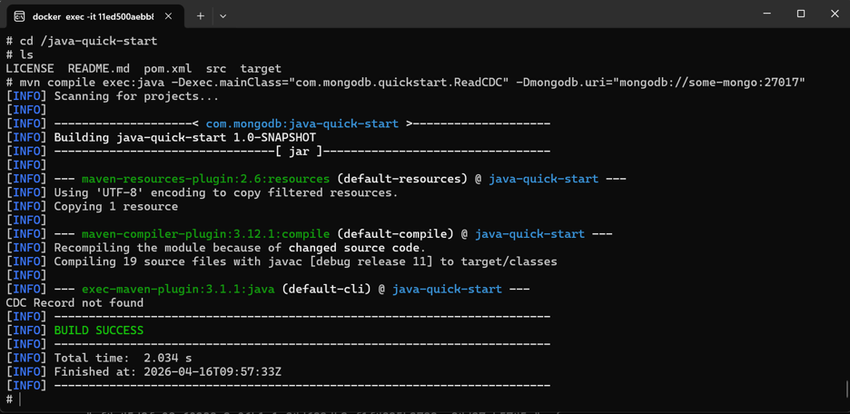
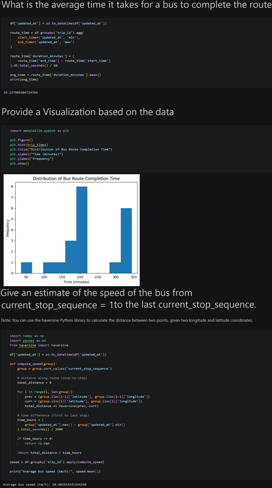

# Real-Time Transit Data Pipeline and Analytics Application


## Table of Contents

- [Overview](#overview)
- [Architecture](#architecture)
- [Data Pipeline Workflow](#data-pipeline-workflow)
- [Key Features](#key-features)
- [Technologies](#technologies)
- [Project Structure](#project-structure)
- [Core Components](#core-components)
- [Database Design](#database-design)
- [Prerequisites](#prerequisites)
- [Setup Instructions](#setup-instructions)
- [Running the Transit Application](#running-the-transit-application)
- [Running the CDC Pipeline](#running-the-cdc-pipeline)
- [Transit Data Analysis](#transit-data-analysis)
- [Project Outputs](#project-outputs)
- [Project Screenshots](#project-screenshots)
- [Lessons Learned](#lessons-learned)
- [Security Note](#security-note)
- [Future Improvements](#future-improvements)
- [Author](#author)

## Overview

This project implements an end-to-end real-time transit data pipeline that retrieves live MBTA Route 1 bus-location data through a REST API, transforms the API response, and stores historical vehicle information in a MySQL database.

A Flask web application retrieves the stored bus coordinates and displays the vehicle locations on an interactive Mapbox map. The project also implements Change Data Capture using Debezium to detect changes in MySQL and transfer the resulting CDC events to MongoDB through a Java Spring Boot application.

A Jupyter Notebook is included to analyze the collected transit data, calculate average route-completion time, visualize operational patterns, and estimate vehicle speed using geographic coordinates.

The project demonstrates:

- REST API data ingestion
- Real-time transit-data processing
- Relational database storage
- NoSQL data integration
- Change Data Capture
- Containerized application deployment
- Interactive map visualization
- Python-based data analysis
- Java and Spring Boot integration

## Architecture

```text
                         MBTA Vehicle REST API
                                    │
                                    ▼
                         Python MBTA API Client
                                    │
                       Parse and transform JSON
                                    │
                                    ▼
                          MySQL Transit Database
                                    │
                    ┌───────────────┴───────────────┐
                    │                               │
                    ▼                               ▼
          Flask Web Application             Debezium CDC Engine
                    │                               │
                    ▼                               ▼
           Mapbox Visualization          Java Spring Boot Listener
                                                    │
                                                    ▼
                                                 MongoDB
                                                    │
                                                    ▼
                                      Java CDC Validation Client

                          MySQL Historical Data
                                    │
                                    ▼
                         Jupyter Notebook Analysis
                                    │
                                    ▼
                  Route Time, Speed, and Visualizations
```

All database and CDC services communicate through the custom Docker network named `MBTANetwork`.

## Data Pipeline Workflow

The application processes transit data through the following stages:

1. Calls the MBTA REST API for Route 1 vehicle information.
2. Parses the returned JSON response using Python.
3. extracts vehicle identification, location, status, trip, and timestamp data.
4. Inserts the transformed vehicle records into the MySQL `mbta_buses` table.
5. Periodically refreshes the bus data using the Flask application timer.
6. Retrieves bus coordinates from MySQL.
7. Sends the coordinates to the Flask web application.
8. Displays bus locations as markers on a Mapbox map.
9. Monitors MySQL database changes using Debezium.
10. Sends CDC events to the Java Spring Boot listener.
11. Stores the captured CDC records in MongoDB.
12. Reads and validates MongoDB records using `ReadCDC.java`.
13. Analyzes the historical transit data in Jupyter Notebook.

## Key Features

### MBTA API Ingestion

- Retrieves live Route 1 bus information from the MBTA REST API.
- Parses nested JSON API responses using Python.
- Extracts vehicle, location, trip, stop, direction, and timestamp attributes.
- Handles multiple buses returned in one API response.
- Prepares the API output for relational database storage.

### MySQL Data Storage

- Creates the `MBTAdb` database.
- Creates and extends the `mbta_buses` table.
- Stores historical bus-location records.
- Preserves operational fields for analytics and downstream processing.
- Uses a Dockerized MySQL database for reproducible local execution.

### Flask Transit Application

- Creates a Python Flask web server.
- Retrieves stored bus records from MySQL.
- Periodically refreshes bus-location information.
- Passes vehicle coordinates to the HTML template.
- Serves the application at `localhost:3000`.

### Mapbox Visualization

- Displays Route 1 buses as markers on an interactive map.
- Uses vehicle latitude and longitude from the MySQL database.
- Provides a visual representation of live transit activity.
- Supports map navigation, zooming, and geographic exploration.

### Change Data Capture

- Uses Debezium Embedded Engine to capture MySQL changes.
- Processes database-change events through Java.
- Uses a Spring Boot listener to handle CDC records.
- Transfers CDC event information from MySQL to MongoDB.
- Demonstrates integration between relational and NoSQL databases.

### MongoDB Validation

- Stores CDC events in the `myDatabase` MongoDB database.
- Writes records to the `myCollection` collection.
- Identifies CDC records using the `recordId` field.
- Uses `ReadCDC.java` to retrieve and validate replicated records.

### Transit Data Analytics

- Loads historical MySQL data into a Pandas DataFrame.
- Creates CSV backup data.
- Calculates average route-completion time.
- Generates visualizations using Matplotlib.
- Estimates vehicle speed using latitude and longitude.
- Uses the Haversine formula to calculate geographic distance.

## Technologies

### Programming Languages

- Python
- Java
- SQL
- JavaScript
- HTML
- CSS

### Data Engineering

- REST API ingestion
- Data transformation
- Change Data Capture
- Real-time data processing
- Relational-to-NoSQL integration
- Data pipeline development
- Data validation

### Databases

- MySQL
- MongoDB

### Application Development

- Flask
- Spring Boot
- Mapbox
- Jupyter Notebook

### Data Analysis

- Pandas
- NumPy
- Matplotlib
- Haversine
- PyMySQL

### DevOps and Tools

- Docker
- Docker networking
- Maven
- Git
- GitHub
- Visual Studio Code

## Project Structure

```text
real-time-transit-data-pipeline/
│
├── README.md
├── .gitignore
├── .gitattributes
├── .env.example
│
├── MBTASample/
│   │
│   ├── Module16 - Template.ipynb
│   │
│   ├── Module16ProjectFlask/
│   │   ├── MBTAApiClient.py
│   │   ├── mysqldb.py
│   │   ├── server.py
│   │   ├── timer.py
│   │   ├── client.py
│   │   └── templates/
│   │       └── index.html
│   │
│   ├── mysqlDocker/
│   │   ├── Dockerfile
│   │   └── MBTA.sql
│   │
│   ├── DebeziumCDC/
│   │   ├── Dockerfile
│   │   ├── README.md
│   │   ├── LICENSE
│   │   └── app/
│   │       ├── pom.xml
│   │       └── src/
│   │           └── main/
│   │               ├── java/
│   │               │   └── mit/edu/tv/
│   │               │       ├── TvApplication.java
│   │               │       ├── config/
│   │               │       │   └── DebeziumConnectorConfig.java
│   │               │       └── listener/
│   │               │           ├── DebeziumListener.java
│   │               │           └── MongoDB.java
│   │               └── resources/
│   │                   └── application.properties
│   │
│   └── java-quick-start/
│       ├── pom.xml
│       └── src/
│           └── main/
│               ├── java/
│               │   └── com/mongodb/quickstart/
│               │       ├── ReadCDC.java
│               │       ├── Connection.java
│               │       ├── Create.java
│               │       ├── Read.java
│               │       ├── Update.java
│               │       └── Delete.java
│               └── resources/
│                   └── logback.xml
│
└── docs/
    └── images/
        ├── mbta-database-schema.png
        ├── docker-database-containers.png
        ├── flask-transit-server.png
        ├── mapbox-bus-visualization.png
        ├── debezium-cdc-listener.png
        ├── spring-boot-cdc-output.png
        ├── docker-services-running.png
        ├── mongodb-cdc-validation.png
        └── transit-data-analysis.png
```

Python cache files, Maven build outputs, local environment files, project-submission documents, and credentials are excluded through `.gitignore`.

## Core Components

### `MBTAApiClient.py`

Connects to the MBTA REST API and transforms the returned vehicle data.

The client extracts information such as:

- Vehicle ID
- Vehicle label
- Latitude
- Longitude
- Bearing
- Direction
- Current status
- Occupancy status
- Stop ID
- Trip ID
- Current stop sequence
- Updated timestamp

The transformed records are passed to the MySQL database layer.

### `mysqldb.py`

Manages the MySQL connection and inserts vehicle records into the `mbta_buses` table.

The database password is read from the `MYSQL_PASSWORD` environment variable rather than being stored directly in the source code.

### `server.py`

Runs the Flask application and:

- Initializes the bus list
- Calls the MBTA API client
- Periodically refreshes transit data
- Sends bus records to the HTML template
- Serves the application on port `3000`

### `index.html`

Creates the Mapbox map and dynamically places bus markers using latitude and longitude values received from Flask.

A valid Mapbox access token must be supplied locally before running the application.

### `DebeziumConnectorConfig.java`

Configures the Debezium Embedded Engine connection to MySQL.

The configuration identifies:

- MySQL host
- MySQL port
- Database credentials
- Monitored database
- Monitored table
- Connector history
- Server identification

### `DebeziumListener.java`

Receives MySQL change events from Debezium and passes the event data to the MongoDB integration class.

### `MongoDB.java`

Connects to MongoDB and inserts CDC records into:

```text
Database: myDatabase
Collection: myCollection
```

### `ReadCDC.java`

Connects to MongoDB and retrieves the CDC document whose `recordId` is set to `CDC`.

This validates that the database change was captured and transferred successfully.

### `Module16 - Template.ipynb`

Performs historical transit-data analysis using:

- Pandas
- NumPy
- PyMySQL
- Matplotlib
- Haversine distance calculations

## Database Design

The MySQL database contains the `mbta_buses` table.

The table stores fields such as:

```text
id
label
latitude
longitude
bearing
direction_id
current_status
occupancy_status
stop_id
trip_id
current_stop_sequence
updated_at
```

These fields support:

- Bus-location tracking
- Route-progress monitoring
- Vehicle-status analysis
- Historical travel-time analysis
- Speed estimation
- CDC event generation

## Prerequisites

Install the following before running the project:

- Git
- Python 3.x
- Docker Desktop
- Java Development Kit
- Maven
- Jupyter Notebook
- A Mapbox account and access token
- A modern web browser

Docker Desktop must be running before executing Docker commands.

## Setup Instructions

### 1. Clone the Repository

Using SSH:

```bash
git clone git@github.com:GeethaBheeman/real-time-transit-data-pipeline.git
cd real-time-transit-data-pipeline
```

Using HTTPS:

```bash
git clone https://github.com/GeethaBheeman/real-time-transit-data-pipeline.git
cd real-time-transit-data-pipeline
```

### 2. Create a Python Virtual Environment

From the repository root:

```bash
python -m venv .venv
```

Activate it on Windows PowerShell:

```powershell
.\.venv\Scripts\Activate.ps1
```

Activate it on macOS or Linux:

```bash
source .venv/bin/activate
```

### 3. Install Python Dependencies

```bash
python -m pip install --upgrade pip
python -m pip install Flask mysql-connector-python pymysql pandas numpy matplotlib haversine notebook
```

### 4. Configure the MySQL Password

The repository includes `.env.example` with placeholder values.

Set the password in Windows PowerShell:

```powershell
$env:MYSQL_PASSWORD="replace-with-your-local-password"
```

On macOS or Linux:

```bash
export MYSQL_PASSWORD="replace-with-your-local-password"
```

Do not commit the real password to Git.

### 5. Configure the Mapbox Token

Open:

```text
MBTASample/Module16ProjectFlask/templates/index.html
```

Replace:

```javascript
mapboxgl.accessToken = "YOUR_MAPBOX_ACCESS_TOKEN";
```

with a restricted local Mapbox token.

Do not commit the real token.

### 6. Create the Docker Network

```bash
docker network create MBTANetwork
```

Verify:

```bash
docker network ls
```

## Running the Transit Application

### 1. Build the MySQL Image

From the repository root:

```bash
docker build -t mysqlmbtamasterimg ./MBTASample/mysqlDocker
```

### 2. Start the MySQL Container

Windows PowerShell:

```powershell
docker run -d `
  --name mysqlserver `
  --network MBTANetwork `
  --env "MYSQL_ROOT_PASSWORD=$env:MYSQL_PASSWORD" `
  -p 3307:3306 `
  mysqlmbtamasterimg
```

macOS or Linux:

```bash
docker run -d \
  --name mysqlserver \
  --network MBTANetwork \
  -e MYSQL_ROOT_PASSWORD="$MYSQL_PASSWORD" \
  -p 3307:3306 \
  mysqlmbtamasterimg
```

Verify:

```bash
docker ps
```

### 3. Start MongoDB

```bash
docker run -d \
  --name some-mongo \
  --network MBTANetwork \
  -p 27017:27017 \
  mongo
```

For Windows PowerShell, the same command can be entered on one line:

```powershell
docker run -d --name some-mongo --network MBTANetwork -p 27017:27017 mongo
```

### 4. Run the Flask Application

Navigate to the Flask project:

```bash
cd MBTASample/Module16ProjectFlask
```

Run:

```bash
python server.py
```

Open:

```text
http://localhost:3000
```

The application displays Route 1 buses as markers on the Mapbox map.

### 5. Verify MySQL Records

Open a MySQL shell inside the container:

```bash
docker exec -it mysqlserver mysql -uroot -p
```

Then run:

```sql
USE MBTAdb;

SELECT *
FROM mbta_buses
ORDER BY updated_at DESC
LIMIT 10;
```

## Running the CDC Pipeline

### 1. Build the Debezium Spring Boot Image

From the repository root:

```bash
docker build -t debeziummodule16 ./MBTASample/DebeziumCDC
```

### 2. Start the Debezium Container

Windows PowerShell:

```powershell
docker run -d `
  --name debeziumcdc `
  --network MBTANetwork `
  --env "MYSQL_PASSWORD=$env:MYSQL_PASSWORD" `
  debeziummodule16
```

macOS or Linux:

```bash
docker run -d \
  --name debeziumcdc \
  --network MBTANetwork \
  -e MYSQL_PASSWORD="$MYSQL_PASSWORD" \
  debeziummodule16
```

### 3. Monitor CDC Events

```bash
docker logs -f debeziumcdc
```

When records are inserted or updated in `mbta_buses`, the Debezium listener captures the change and writes the event to MongoDB.

### 4. Validate the MongoDB Record

Navigate to:

```bash
cd MBTASample/java-quick-start
```

Run:

```bash
mvn compile exec:java \
  -Dexec.mainClass="com.mongodb.quickstart.ReadCDC" \
  -Dmongodb.uri="mongodb://localhost:27017"
```

For Windows PowerShell:

```powershell
mvn compile exec:java `
  "-Dexec.mainClass=com.mongodb.quickstart.ReadCDC" `
  "-Dmongodb.uri=mongodb://localhost:27017"
```

A successful query displays the CDC document stored in MongoDB.

### 5. Inspect MongoDB Directly

```bash
docker exec -it some-mongo mongosh
```

Then run:

```javascript
use myDatabase

db.myCollection.find().pretty()
```

## Transit Data Analysis

Open the notebook:

```bash
jupyter notebook "MBTASample/Module16 - Template.ipynb"
```

The notebook performs the following steps:

1. Retrieves MBTA API data.
2. Connects to the MySQL transit database.
3. Loads database records into a Pandas DataFrame.
4. Saves the transit data as a CSV backup.
5. Cleans and prepares timestamp and location fields.
6. Calculates the average time required for a bus to complete the route.
7. Creates data visualizations using Matplotlib.
8. Groups bus records by vehicle or trip.
9. Calculates geographic distance using the Haversine formula.
10. Estimates average vehicle speed between the first and last route positions.

## Project Outputs

The project produces:

- Live MBTA Route 1 API responses
- Structured transit records in MySQL
- Historical bus-location data
- An interactive Mapbox bus-location application
- Debezium CDC events
- Replicated CDC records in MongoDB
- Java-based CDC validation output
- Pandas DataFrames for analysis
- CSV backup data
- Route-completion-time analysis
- Transit-data visualizations
- Estimated bus-speed calculations

## Project Screenshots

Create the following folder in the repository:

```text
docs/images/
```

### MySQL Transit Table

The expanded `mbta_buses` table stores vehicle, location, route, status, and timestamp information.



### Dockerized Database Services

The MySQL and MongoDB containers run on the shared `MBTANetwork` Docker network.



### Flask Transit Server

The Flask server periodically retrieves and updates MBTA vehicle information.



### Mapbox Bus Visualization

The application displays MBTA Route 1 vehicle positions on an interactive map.



### Debezium CDC Listener

The Java listener processes MySQL changes generated by the Debezium Embedded Engine.



### Spring Boot CDC Execution

The Maven Spring Boot application connects to MySQL and listens for database-change events.



### Docker Services

MySQL, MongoDB, Debezium, and Java/Maven services run in Docker containers.



### MongoDB CDC Validation

The Java MongoDB client queries the replicated CDC record.



### Transit Data Analysis

The Jupyter Notebook analyzes route-completion time and estimated bus speed.



## Lessons Learned

During this project, I gained hands-on experience in:

- Integrating a public REST API with a data pipeline.
- Parsing nested JSON responses using Python.
- Designing a relational schema for transit data.
- Storing and querying historical vehicle-location information in MySQL.
- Connecting Python applications to a containerized database.
- Building a Flask application that serves continuously updated data.
- Displaying geographic coordinates on an interactive Mapbox map.
- Creating and managing Docker images, containers, ports, and networks.
- Implementing Change Data Capture using Debezium Embedded Engine.
- Processing database-change events using Java and Spring Boot.
- Transferring data between MySQL and MongoDB.
- Validating NoSQL records using a Java MongoDB client.
- Loading relational data into Pandas.
- Calculating route-completion time from timestamped records.
- Estimating travel distance using latitude and longitude.
- Calculating vehicle speed using the Haversine formula.
- Troubleshooting database connectivity, Docker networking, Maven builds, and environment configuration.

## Security Note

This repository does not include real database passwords or unrestricted Mapbox access tokens.

Before running the project:

- Set the MySQL password through the `MYSQL_PASSWORD` environment variable.
- Replace the Mapbox placeholder with a restricted local token.
- Do not commit `.env` files.
- Do not hard-code credentials in Python, Java, HTML, notebooks, or Dockerfiles.
- Restrict database and application ports in non-local environments.
- Use a secrets-management service for production deployments.
- Rotate any token or password that has previously been exposed.
- Remove sensitive information from screenshots before publishing them.

The credentials and container settings in this project are intended for local educational use only.

## Future Improvements

- Add a `requirements.txt` file for Python dependencies.
- Add Docker Compose to start all services through one command.
- Move the Mapbox token into a secure runtime configuration.
- Add retry and timeout handling for MBTA API requests.
- Add API response validation and structured error logging.
- Prevent duplicate vehicle records through database constraints.
- Add indexes to improve route and timestamp queries.
- Add automated data-quality checks.
- Add unit tests for the API client and database layer.
- Add integration tests for the CDC workflow.
- Store raw and curated transit data separately.
- Add a message broker between CDC producers and consumers.
- Add monitoring and alerting for container or pipeline failures.
- Add dashboard filters for vehicle, route, status, and time.
- Add historical route playback to the map.
- Calculate distance, speed, and route duration automatically.
- Add GitHub Actions for automated testing.
- Deploy the application and databases to a cloud platform.

## Author

**Geetha Bheeman**

MIT xPRO — Professional Certificate in Data Engineering
